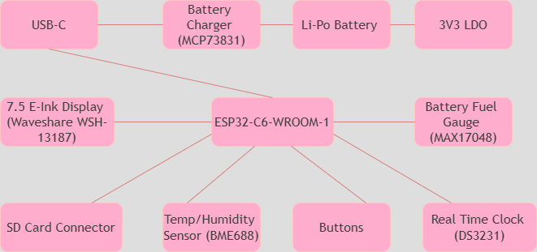

Szabo Cristina-Andreea
# E-book Reader
The project (Openbook) is an E-book reader built around the ESP32-C6-WROOM-1-N8 microcontroller, which integrates Wi-Fi and Bluetooth Low Energy functionality. It is responsible for managing communication between the connected components, sensor data acquisition, and display handling. It has a 7.5-inch e-paper display, USB-C charging, a Li-Po battery, and 3 buttons.

## Block diagram:

## BOM - Bill of materials
| Component       | Device                | Link                                                                 | Datasheet                                                                 |
|-----------------|-----------------------|----------------------------------------------------------------------|---------------------------------------------------------------------------|
| BOOT_BUTTON     | BUTTON_CUSYOMV1        | [Link]([https://ro.mouser.com/ProductDetail/Panasonic/EVQ-P7L01P](https://ro.mouser.com/ProductDetail/Panasonic/EVQ-P7L01P?qs=rJ%252BziJWpyszWhhNszc02jQ%3D%3D&_gl=1*xzqk3l*_ga*dW5kZWZpbmVk*_ga_15W4STQT4T*dW5kZWZpbmVk*_ga_1KQLCYKRX3*dW5kZWZpbmVk)     | [Datasheet](https://componentsearchengine.com/Datasheets/2/EVQP7L01P.pdf) |
| C1              | ESP32_WROVER_EAGLE-LTSPICE_CC0402 | [Link](https://ro.mouser.com/ProductDetail/YAGEO/CC0402MRX5R5BB106)  | [Datasheet](https://componentsearchengine.com/Datasheets/2/CC0402MRX5R5BB106.pdf) |
| C1_BAT          | ESP32_WROVER_EAGLE-LTSPICE_CC0402 | [Link](https://ro.mouser.com/ProductDetail/YAGEO/CC0402MRX5R5BB106)  | [Datasheet](https://componentsearchengine.com/Datasheets/2/CC0402MRX5R5BB106.pdf) |
| C1_BAT1         | EAGLE-LTSPICE_CC0402   | [Link](https://ro.mouser.com/ProductDetail/YAGEO/CC0402MRX5R5BB106)  | [Datasheet](https://componentsearchengine.com/Datasheets/2/CC0402MRX5R5BB106.pdf) |
| C1_BAT2         | EAGLE-LTSPICE_CC0402   | [Link](https://ro.mouser.com/ProductDetail/YAGEO/CC0402MRX5R5BB106)  | [Datasheet](https://componentsearchengine.com/Datasheets/2/CC0402MRX5R5BB106.pdf) |
| C2              | ESP32_WROVER_EAGLE-LTSPICE_CC0402 | [Link](https://ro.mouser.com/ProductDetail/YAGEO/CC0402MRX5R5BB106)  | [Datasheet](https://componentsearchengine.com/Datasheets/2/CC0402MRX5R5BB106.pdf) |
| C2_BAT          | ESP32_WROVER_EAGLE-LTSPICE_CC0402 | [Link](https://ro.mouser.com/ProductDetail/YAGEO/CC0402MRX5R5BB106)  | [Datasheet](https://componentsearchengine.com/Datasheets/2/CC0402MRX5R5BB106.pdf) |
| C3              | RCL_CPOL-EUCT3528      | [Link](https://ro.mouser.com/ProductDetail/YAGEO/CC0402MRX5R5BB106)  | [Datasheet](https://componentsearchengine.com/Datasheets/2/CC0402MRX5R5BB106.pdf) |
| C4              | ESP32_WROVER_EAGLE-LTSPICE_CC0402 | [Link](https://ro.mouser.com/ProductDetail/YAGEO/CC0402MRX5R5BB106)  | [Datasheet](https://componentsearchengine.com/Datasheets/2/CC0402MRX5R5BB106.pdf) |
| C4_USB          | ESP32_WROVER_EAGLE-LTSPICE_CC0402 | [Link](https://ro.mouser.com/ProductDetail/YAGEO/CC0402MRX5R5BB106)  | [Datasheet](https://componentsearchengine.com/Datasheets/2/CC0402MRX5R5BB106.pdf) |
| C5              | ESP32_WROVER_EAGLE-LTSPICE_CC0402 | [Link](https://ro.mouser.com/ProductDetail/YAGEO/CC0402MRX5R5BB106)  | [Datasheet](https://componentsearchengine.com/Datasheets/2/CC0402MRX5R5BB106.pdf) |
| C5_USB          | ESP32_WROVER_EAGLE-LTSPICE_CC0402 | [Link](https://ro.mouser.com/ProductDetail/YAGEO/CC0402MRX5R5BB106)  | [Datasheet](https://componentsearchengine.com/Datasheets/2/CC0402MRX5R5BB106.pdf) |
| C6              | ESP32_WROVER_EAGLE-LTSPICE_CC0402 | [Link](https://ro.mouser.com/ProductDetail/YAGEO/CC0402MRX5R5BB106)  | [Datasheet](https://componentsearchengine.com/Datasheets/2/CC0402MRX5R5BB106.pdf) |
| C7              | ESP32_WROVER_EAGLE-LTSPICE_CC0402 | [Link](https://ro.mouser.com/ProductDetail/YAGEO/CC0402MRX5R5BB106)  | [Datasheet](https://componentsearchengine.com/Datasheets/2/CC0402MRX5R5BB106.pdf) |
| C8              | ESP32_WROVER_EAGLE-LTSPICE_CC0402 | [Link](https://ro.mouser.com/ProductDetail/YAGEO/CC0402MRX5R5BB106)  | [Datasheet](https://componentsearchengine.com/Datasheets/2/CC0402MRX5R5BB106.pdf) |
| C9              | EAGLE-LTSPICE_CC0402   | [Link](https://ro.mouser.com/ProductDetail/YAGEO/CC0402MRX5R5BB106)  | [Datasheet](https://componentsearchengine.com/Datasheets/2/CC0402MRX5R5BB106.pdf) |
| C10             | ESP32_WROVER_EAGLE-LTSPICE_CC0402 | [Link](https://ro.mouser.com/ProductDetail/YAGEO/CC0402MRX5R5BB106)  | [Datasheet](https://componentsearchengine.com/Datasheets/2/CC0402MRX5R5BB106.pdf) |
| C10_SUPERCAP    | CPH3225A               | [Link](https://ro.mouser.com/ProductDetail/Seiko-Semiconductors/CPH3225A) | [Datasheet](https://ro.mouser.com/datasheet/2/360/Seiko_Instruments_MicroBattery_E_20230330_2024Jan_-3561061.pdf) |
| CHANGE_BUTTON   | BUTTON_CUSYOMV1        | [Link](https://ro.mouser.com/ProductDetail/Panasonic/EVQ-P7L01P)     | [Datasheet](https://componentsearchengine.com/Datasheets/2/EVQP7L01P.pdf) |
| C_DELAY         | ESP32_WROVER_EAGLE-LTSPICE_CC0402 | [Link](https://ro.mouser.com/ProductDetail/YAGEO/CC0402MRX5R5BB106)  | [Datasheet](https://componentsearchengine.com/Datasheets/2/CC0402MRX5R5BB106.pdf) |
| D1              | USBLC6-2SC6Y           | [Link](https://ro.mouser.com/ProductDetail/STMicroelectronics/USBLC6-2SC6Y) | [Datasheet](https://ro.mouser.com/datasheet/2/389/usblc6_2sc6y-1852505.pdf) |
| D2              | ESP32_WROVER_AVX---SD0805S020S1R0_AVX_... | [Link](https://eu.mouser.com/ProductDetail/KYOCERA-AVX/SD0805S020S1R0?qs=jCA%252BPfw4LHbpkAoSnwrdjw%3D%3D) | [Datasheet](http://datasheets.avx.com/schottky.pdf) |
| D3              | MBR0530               | [Link](https://eu.mouser.com/ProductDetail/Vishay-Semiconductors/MBR0530) | [Datasheet](https://www.onsemi.com/pdf/datasheet/mbr0530-d.pdf) |
| D4              | MBR0530               | [Link](https://www.snapeda.com/parts/MBR0530/Onsemi/view-part/?ref=eda) | [Datasheet](https://www.snapeda.com/parts/MBR0530/Onsemi/view-part/?ref=eda) |
| D5              | MBR0530               | [Link](https://www.snapeda.com/parts/MBR0530/Onsemi/view-part/?ref=eda) | [Datasheet](https://www.snapeda.com/parts/MBR0530/Onsemi/view-part/?ref=eda) |
| D6              | PGB1010603MR          | [Link](https://www.snapeda.com/parts/PGB1010603MR/Littelfuse/view-part/?ref=eda) | [Datasheet](https://www.snapeda.com/parts/PGB1010603MR/Littelfuse/view-part/?ref=eda) |
| D7              | ESP32_WROVER_AVX---SD0805S020S1R0_AVX_... | [Link](https://eu.mouser.com/ProductDetail/KYOCERA-AVX/SD0805S020S1R0?qs=jCA%252BPfw4LHbpkAoSnwrdjw%3D%3D) | [Datasheet](http://datasheets.avx.com/schottky.pdf) |
| D8              | PGB1010603MR          | [Link](https://www.snapeda.com/parts/PGB1010603MR/Littelfuse/view-part/?ref=eda) | [Datasheet](https://www.snapeda.com/parts/PGB1010603MR/Littelfuse/view-part/?ref=eda) |
| D9              | PGB1010603MR          | [Link](https://www.snapeda.com/parts/PGB1010603MR/Littelfuse/view-part/?ref=eda) | [Datasheet](https://www.snapeda.com/parts/PGB1010603MR/Littelfuse/view-part/?ref=eda) |
| D10             | PGB1010603MR          | [Link](https://www.snapeda.com/parts/PGB1010603MR/Littelfuse/view-part/?ref=eda) | [Datasheet](https://www.snapeda.com/parts/PGB1010603MR/Littelfuse/view-part/?ref=eda) |
| D11             | PGB1010603MR          | [Link](https://www.snapeda.com/parts/PGB1010603MR/Littelfuse/view-part/?ref=eda) | [Datasheet](https://www.snapeda.com/parts/PGB1010603MR/Littelfuse/view-part/?ref=eda) |
| D12             | PGB1010603MR          | [Link](https://www.snapeda.com/parts/PGB1010603MR/Littelfuse/view-part/?ref=eda) | [Datasheet](https://www.snapeda.com/parts/PGB1010603MR/Littelfuse/view-part/?ref=eda) |
| EPD_C1          | ESP32_WROVER_EAGLE-LTSPICE_CC0402 | [Link](https://ro.mouser.com/ProductDetail/YAGEO/CC0402MRX5R5BB106)  | [Datasheet](https://componentsearchengine.com/Datasheets/2/CC0402MRX5R5BB106.pdf) |
| EPD_C2          | ESP32_WROVER_EAGLE-LTSPICE_CC0402 | [Link](https://ro.mouser.com/ProductDetail/YAGEO/CC0402MRX5R5BB106)  | [Datasheet](https://componentsearchengine.com/Datasheets/2/CC0402MRX5R5BB106.pdf) |
| EPD_C5          | ESP32_WROVER_EAGLE-LTSPICE_CC0402 | [Link](https://ro.mouser.com/ProductDetail/YAGEO/CC0402MRX5R5BB106)  | [Datasheet](https://componentsearchengine.com/Datasheets/2/CC0402MRX5R5BB106.pdf) |
| EPD_C6          | ESP32_WROVER_EAGLE-LTSPICE_CC0402 | [Link](https://ro.mouser.com/ProductDetail/YAGEO/CC0402MRX5R5BB106)  | [Datasheet](https://componentsearchengine.com/Datasheets/2/CC0402MRX5R5BB106.pdf) |
| EPD_C7          | ESP32_WROVER_EAGLE-LTSPICE_CC0402 | [Link](https://ro.mouser.com/ProductDetail/YAGEO/CC0402MRX5R5BB106)  | [Datasheet](https://componentsearchengine.com/Datasheets/2/CC0402MRX5R5BB106.pdf) |
| EPD_C8          | ESP32_WROVER_EAGLE-LTSPICE_CC0402 | [Link](https://ro.mouser.com/ProductDetail/YAGEO/CC0402MRX5R5BB106)  | [Datasheet](https://componentsearchengine.com/Datasheets/2/CC0402MRX5R5BB106.pdf) |
| EPD_C9          | ESP32_WROVER_EAGLE-LTSPICE_CC0402 | [Link](https://ro.mouser.com/ProductDetail/YAGEO/CC0402MRX5R5BB106)  | [Datasheet](https://componentsearchengine.com/Datasheets/2/CC0402MRX5R5BB106.pdf) |
| EPD_C10         | ESP32_WROVER_EAGLE-LTSPICE_CC0402 | [Link](https://ro.mouser.com/ProductDetail/YAGEO/CC0402MRX5R5BB106)  | [Datasheet](https://componentsearchengine.com/Datasheets/2/CC0402MRX5R5BB106.pdf) |
| EPD_C11         | ESP32_WROVER_EAGLE-LTSPICE_CC0402 | [Link](https://ro.mouser.com/ProductDetail/YAGEO/CC0402MRX5R5BB106)  | [Datasheet](https://componentsearchengine.com/Datasheets/2/CC0402MRX5R5BB106.pdf) |
| EPD_C12         | ESP32_WROVER_EAGLE-LTSPICE_CC0402 | [Link](https://ro.mouser.com/ProductDetail/YAGEO/CC0402MRX5R5BB106)  | [Datasheet](https://componentsearchengine.com/Datasheets/2/CC0402MRX5R5BB106.pdf) |
| IC1             | BD5229G-TR            | [Link](https://ro.mouser.com/ProductDetail/ROHM-Semiconductor/BD5229G-TR) | [Datasheet](https://fscdn.rohm.com/en/products/databook/datasheet/ic/power/voltage_detector/bd52xxg-e.pdf) |
| IC4             | XC6220A331MR-G        | [Link](https://ro.mouser.com/ProductDetail/Torex-Semiconductor/XC6220A331MR-G) | [Datasheet](https://ro.mouser.com/datasheet/2/760/xc6220-3371556.pdf) |
| J1              | FH34SRJ-24S-0.5SH_99_ | [Link](https://ro.mouser.com/ProductDetail/Hirose-Connector/FH34SRJ-24S-0.5SH99) | [Datasheet](https://ro.mouser.com/datasheet/2/185/FH34SRJ_24S_0_5SH_99__CL0580_1255_6_99_2DDrawing_0-1615044.pdf) |
| J2              | USB4110-GF-A          | [Link](https://ro.mouser.com/ProductDetail/GCT/USB4110-GF-A) | [Datasheet](https://ro.mouser.com/datasheet/2/837/GCT_USB4110_Product_Drawing___20k_cycles-3455479.pdf) |
| J3              | QWIIC_CONNECTORJS-1MM | [Link](https://ro.mouser.com/ProductDetail/SparkFun/PRT-14417) | [Datasheet](https://ro.mouser.com/datasheet/2/813/Qwiic_Connector_Datasheet-1223982.pdf) |
| J4              | 112A-TAAR-R03_ATTEND  | [Link](https://store.comet.srl.ro/Catalogue/Product/43497/) | [Datasheet](https://store.comet.srl.ro/Catalogue/Product/43497/) |
| L1              | 744043680IND_4828-WE-TPC_WRE | [Link](https://eu.mouser.com/ProductDetail/Wurth-Elektronik/744043680) | [Datasheet](https://eu.mouser.com/ProductDetail/Wurth-Elektronik/744043680?qs=PGXP4M47uW6VkZq%252BkzjrHA%3D%3D) |
| PFMF.050.1      | ESP32C6_VARISTORCN1812 | [Link](https://www.mouser.co.uk/ProductDetail/EPCOS-TDK/B72520T0350K062) | [Datasheet](https://www.mouser.co.uk/ProductDetail/EPCOS-TDK/B72520T0350K062?qs=dEfas%2FXlABIszF52uu7vrg%3D%3D) |
| Q1              | DMG2305UX-7           | [Link](https://ro.mouser.com/ProductDetail/Diodes-Incorporated/DMG2305UX-7) | [Datasheet](https://www.diodes.com/assets/Datasheets/DMG2305UX.pdf) |
| Q2              | ESP32_WROVER_SPARKFUN-DISCRETESEMI_MOSFET_... | [Link](https://ro.mouser.com/ProductDetail/Diodes-Incorporated/DMG2305UX-7) | [Datasheet](https://www.diodes.com/assets/Datasheets/DMG2305UX.pdf) |
| Q3              | D8                    | [Link](https://componentsearchengine.com/part-view/SI1308EDL-T1-GE3/Vishay) | [Datasheet](https://componentsearchengine.com/part-view/SI1308EDL-T1-GE3/Vishay) |
| R1              | ESP32_WROVER_EAGLE-LTSPICE_RR0402 | [Link](https://ro.mouser.com/ProductDetail/YAGEO/RC0402FR-07100KL) | [Datasheet](https://ro.mouser.com/datasheet/2/447/YAGEO_PYu_RC_Group_51_RoHS_L_12-3313492.pdf) |
| R1_PINH         | ESP32_WROVER_EAGLE-LTSPICE_RR0402 | [Link](https://ro.mouser.com/ProductDetail/YAGEO/RC0402FR-07100KL) | [Datasheet](https://ro.mouser.com/datasheet/2/447/YAGEO_PYu_RC_Group_51_RoHS_L_12-3313492.pdf) |
| R1_PINH1        | ESP32_WROVER_EAGLE-LTSPICE_RR0402 | [Link](https://ro.mouser.com/ProductDetail/YAGEO/RC0402FR-07100KL) | [Datasheet](https://ro.mouser.com/datasheet/2/447/YAGEO_PYu_RC_Group_51_RoHS_L_12-3313492.pdf) |
| R1_BAT          | ESP32_WROVER_EAGLE-LTSPICE_RR0402 | [Link](https://ro.mouser.com/ProductDetail/YAGEO/RC0402FR-07100KL) | [Datasheet](https://ro.mouser.com/datasheet/2/447/YAGEO_PYu_RC_Group_51_RoHS_L_12-3313492.pdf) |
| R1_PWRUSB       | ESP32_WROVER_EAGLE-LTSPICE_RR0402 | [Link](https://ro.mouser.com/ProductDetail/YAGEO/RC0402FR-07100KL) | [Datasheet](https://ro.mouser.com/datasheet/2/447/YAGEO_PYu_RC_Group_51_RoHS_L_12-3313492.pdf) |
| R2              | ESP32_WROVER_EAGLE-LTSPICE_RR0402 | [Link](https://ro.mouser.com/ProductDetail/YAGEO/RC0402FR-07100KL) | [Datasheet](https://componentsearchengine.com/part-view/R0402%201%25%20100%20K%20(RC0402FR-07100KL) |
| R2_PINH         | ESP32_WROVER_EAGLE-LTSPICE_RR0402 | [Link](https://ro.mouser.com/ProductDetail/YAGEO/RC0402FR-07100KL) | [Datasheet](https://ro.mouser.com/datasheet/2/447/YAGEO_PYu_RC_Group_51_RoHS_L_12-3313492.pdf) |
| R2_PINH1        | ESP32_WROVER_EAGLE-LTSPICE_RR0402 | [Link](https://ro.mouser.com/ProductDetail/YAGEO/RC0402FR-07100KL) | [Datasheet](https://ro.mouser.com/datasheet/2/447/YAGEO_PYu_RC_Group_51_RoHS_L_12-3313492.pdf) |
| R2_USB          | ESP32_WROVER_EAGLE-LTSPICE_RR0402 | [Link](https://ro.mouser.com/ProductDetail/YAGEO/RC0402FR-07100KL) | [Datasheet](https://ro.mouser.com/datasheet/2/447/YAGEO_PYu_RC_Group_51_RoHS_L_12-3313492.pdf) |
| R2_USB1         | ESP32_WROVER_EAGLE-LTSPICE_RR0402 | [Link](https://ro.mouser.com/ProductDetail/YAGEO/RC0402FR-07100KL) | [Datasheet](https://ro.mouser.com/datasheet/2/447/YAGEO_PYu_RC_Group_51_RoHS_L_12-3313492.pdf) |
| R2_BAT          | ESP32_WROVER_EAGLE-LTSPICE_RR0402 | [Link](https://ro.mouser.com/ProductDetail/YAGEO/RC0402FR-07100KL) | [Datasheet](https://ro.mouser.com/datasheet/2/447/YAGEO_PYu_RC_Group_51_RoHS_L_12-3313492.pdf) |
| R3              | ESP32_WROVER_EAGLE-LTSPICE_RR0402 | [Link](https://ro.mouser.com/ProductDetail/YAGEO/RC0402FR-07100KL) | [Datasheet](https://ro.mouser.com/datasheet/2/447/YAGEO_PYu_RC_Group_51_RoHS_L_12-3313492.pdf) |
| R4              | ESP32_WROVER_EAGLE-LTSPICE_RR0402 | [Link](https://ro.mouser.com/ProductDetail/YAGEO/RC0402FR-07100KL) | [Datasheet](https://ro.mouser.com/datasheet/2/447/YAGEO_PYu_RC_Group_51_RoHS_L_12-3313492.pdf) |
| R5              | ESP32_WROVER_EAGLE-LTSPICE_RR0402 | [Link](https://ro.mouser.com/ProductDetail/YAGEO/RC0402FR-07100KL) | [Datasheet](https://ro.mouser.com/datasheet/2/447/YAGEO_PYu_RC_Group_51_RoHS_L_12-3313492.pdf) |
| R6              | ESP32_WROVER_EAGLE-LTSPICE_RR0402 | [Link](https://ro.mouser.com/ProductDetail/YAGEO/RC0402FR-07100KL) | [Datasheet](https://ro.mouser.com/datasheet/2/447/YAGEO_PYu_RC_Group_51_RoHS_L_12-3313492.pdf) |
| R7              | ESP32_WROVER_EAGLE-LTSPICE_RR0402 | [Link](https://ro.mouser.com/ProductDetail/YAGEO/RC0402FR-07100KL) | [Datasheet](https://ro.mouser.com/datasheet/2/447/YAGEO_PYu_RC_Group_51_RoHS_L_12-3313492.pdf) |
| R8              | ESP32_WROVER_EAGLE-LTSPICE_RR0402 | [Link](https://ro.mouser.com/ProductDetail/YAGEO/RC0402FR-07100KL) | [Datasheet](https://ro.mouser.com/datasheet/2/447/YAGEO_PYu_RC_Group_51_RoHS_L_12-3313492.pdf) |
| R9              | ESP32_WROVER_EAGLE-LTSPICE_RR0402 | [Link](https://ro.mouser.com/ProductDetail/YAGEO/RC0402FR-07100KL) | [Datasheet](https://ro.mouser.com/datasheet/2/447/YAGEO_PYu_RC_Group_51_RoHS_L_12-3313492.pdf) |
| R10             | ESP32_WROVER_EAGLE-LTSPICE_RR0402 | [Link](https://ro.mouser.com/ProductDetail/YAGEO/RC0402FR-07100KL) | [Datasheet](https://ro.mouser.com/datasheet/2/447/YAGEO_PYu_RC_Group_51_RoHS_L_12-3313492.pdf) |
| RESET_BUTTON    | BUTTON_CUSYOMV1        | [Link](https://ro.mouser.com/ProductDetail/Panasonic/EVQ-P7L01P)     | [Datasheet](https://componentsearchengine.com/Datasheets/2/EVQP7L01P.pdf) |
| R_BOOT          | ESP32_WROVER_EAGLE-LTSPICE_RR0402 | [Link](https://ro.mouser.com/ProductDetail/YAGEO/RC0402FR-07100KL) | [Datasheet](https://ro.mouser.com/datasheet/2/447/YAGEO_PYu_RC_Group_51_RoHS_L_12-3313492.pdf) |
| R_CAPACITOR     | ESP32_WROVER_EAGLE-LTSPICE_RR0402 | [Link](https://ro.mouser.com/ProductDetail/YAGEO/RC0402FR-07100KL) | [Datasheet](https://ro.mouser.com/datasheet/2/447/YAGEO_PYu_RC_Group_51_RoHS_L_12-3313492.pdf) |
| R_CHANGE        | ESP32_WROVER_EAGLE-LTSPICE_RR0402 | [Link](https://ro.mouser.com/ProductDetail/YAGEO/RC0402FR-07100KL) | [Datasheet](https://ro.mouser.com/datasheet/2/447/YAGEO_PYu_RC_Group_51_RoHS_L_12-3313492.pdf) |
| R_CL1           | ESP32_WROVER_EAGLE-LTSPICE_RR0402 | [Link](https://ro.mouser.com/ProductDetail/YAGEO/RC0402FR-07100KL) | [Datasheet](https://ro.mouser.com/datasheet/2/447/YAGEO_PYu_RC_Group_51_RoHS_L_12-3313492.pdf) |
| R_RESET         | ESP32_WROVER_EAGLE-LTSPICE_RR0402 | [Link](https://ro.mouser.com/ProductDetail/YAGEO/RC0402FR-07100KL) | [Datasheet](https://ro.mouser.com/datasheet/2/447/YAGEO_PYu_RC_Group_51_RoHS_L_12-3313492.pdf) |
| SENSOR2         | ESP32_WROVER_BME680_BME680 | [Link](https://ro.mouser.com/ProductDetail/Bosch-Sensortec/BME680) | [Datasheet](https://ro.mouser.com/datasheet/2/783/BST_BME680_DS001-1509608.pdf) |
| SJ1             | SJ                     | [Link](https://grabcad.com/library/solder-jumpers-1)                | [Datasheet](https://grabcad.com/library/solder-jumpers-1)                |
| TP1 - TP17      | TPTP20R               | -                                                               | -                                                                    |
| U1              | W25Q512JVEIQ          | [Link](https://ro.mouser.com/ProductDetail/Winbond/W25Q512JVEIQ)     | [Datasheet](https://ro.mouser.com/datasheet/2/949/Winbond_W25Q512JV_Datasheet-3240039.pdf) |
| U2              | ESP32-C6-WROOM-1-N8   | [Link](https://ro.mouser.com/ProductDetail/Espressif-Systems/ESP32-C6-WROOM-1-N8) | [Datasheet](https://ro.mouser.com/datasheet/2/891/Espressif_ESP32_C6_WROOM_1__Datasheet_V0_1_PRELIMI-3239987.pdf) |
| U3              | DS3231SN#             | [Link](https://ro.mouser.com/ProductDetail/Analog-Devices-Maxim-Integrated/DS3231SN) | [Datasheet](https://ro.mouser.com/datasheet/2/609/DS3231-3421123.pdf) |
| U4              | MAX17048G+T10         | [Link](https://ro.mouser.com/ProductDetail/Analog-Devices-Maxim-Integrated/MAX17048G+T10) | [Datasheet](https://ro.mouser.com/datasheet/2/609/MAX17048_MAX17049-3469099.pdf) |
| U5              | ESP32_WROVER_SPARKFUN-IC-POWER_MCP73831 | [Link](https://ro.mouser.com/ProductDetail/Microchip-Technology/MCP73831T-2ACI-OT) | [Datasheet](https://ro.mouser.com/datasheet/2/268/MCP73831_Family_Data_Sheet_DS20001984H-3441711.pdf) |

## Hardware description:
- ESP32-C6-WROOM-1-N8: The heart of the system, providing Wi-Fi and BLE capabilities for wireless communication.
- BME688: An environmental and air quality sensor that measures temperature, humidity, pressure, and gas. It communicates with the ESP32 via the I2C protocol.
- DS3231SN: A high-precision Real-Time Clock (RTC) module, connected via I2C for accurate timekeeping.
- MAX17048: A battery level monitor with I2C interface, used to provide the State of Charge (SOC) estimation for the battery.
- SD Card Module: Provides local data storage, communicating with the ESP32 using the SPI protocol for faster read/write operations.
- E-Ink Display: A low-power e-paper display with an SPI interface for minimal energy consumption. It includes the following control signals: EPD_CS, EPD_DC, EPD_RST, and EPD_BUSY.
- W25Q512JVEIQ (64MB NOR Flash): External flash memory connected via SPI, used for storing firmware or large datasets.
- BOOT and RESET Buttons: Connected to GPIO pins to manage the bootloader activation and system reset.
- MCP73831: A Li-Po battery charging controller, responsible for managing the charging process of the battery.
- XC6220A331MR-G (LDO Regulator): A 3.3V voltage regulator that powers the logic circuits of the system from the battery or USB input.
- USB-C Port (USB4110-GF-A): Provides power input and serves as the serial interface for code uploading and debugging.

## Pins description:
- IO0 - INT_RTC: Interrupt signal from the RTC that can wake up the ESP32 from deep sleep. This pin is used by the RTC.
- IO1 – 32KHZ: The 32.768 kHz clock output from the DS3231 RTC, routed to the ESP32 for accurate timekeeping.
- IO2 – MISO: This is the Master In Slave Out pin for SPI communication, used for NOR Flash, E-Paper, and microSD data transfer.
- IO3 - EPD_BUSY: E-Ink Display status signal that indicates whether the screen is busy. The ESP32 reads this to determine when it can send the next display update.
- IO4 – SS_SD: SPI Select pin for the microSD card, ensuring it does not conflict with other SPI devices using Chip Select (CS) lines.
- IO5 – EPD_DC: E-Ink Display Data/Command line used to differentiate between command and data states.
- IO6 – SCK: The SPI Clock pin, used to synchronize data transmission for peripherals like NOR Flash, E-Paper, and microSD.
- IO7 – MOSI: Master Out Slave In pin for SPI communication, used to send data to NOR Flash, E-Paper, and microSD.
- IO9 – IO/BOOT: This is a GPIO pin used for entering programming mode and activating the bootloader when the system is powered on.
- IO10 - EPD_CS: E-Ink Display Chip Select pin, allowing the display to be selected during SPI communication without interfering with other devices.
- IO11 – FLASH_CS: Chip Select pin for the NOR Flash memory, used to activate the flash memory module during SPI communication.
- IO12 – USB_D-: USB Data- line, directly connected to the USB-C connector, enabling power input and data transfer for code uploading and debugging.
- IO13 – USB_D+: USB Data+ line, also routed to the USB-C connector, enabling data transfer for serial communication and debugging.
- IO15 – IO/CHANGE: A GPIO pin used for user-defined actions, such as navigating between pages or changing modes.
- IO16 – TX: Serial Transmit pin used for flashing the older ESP chips and for serial debug logs.
- IO17 – RX: Serial Receive pin used for receiving data during flashing and for serial communication in debug mode.
- IO18 – RTC_RST: Manual Reset pin for the RTC module. It can be used to reset the RTC for synchronization or during a watchdog reset.
- IO19 – I2C_PW: Provides 3.3V to power I2C peripherals, including the RTC, BME688, and battery gauge modules.
- IO20 – EPD_3V3_C: A 3.3V supply line dedicated to powering the E-Ink Display.
- IO21 – SDA: I2C Data line used for communication with the RTC, BME688, and other I2C devices.
- IO22 – SCL: I2C Clock line used for synchronization of data transfer between the ESP32 and I2C devices.
- IO23 – EPD_RST: E-Ink Display Reset pin used to initialize the display before any updates or during power-up.

## Power consumption:
The system is designed to operate efficiently, with attention to low power consumption. The E-Ink Display is a key contributor to low energy use, as it only requires power during updates. The ESP32-C6 is capable of entering deep sleep modes, significantly reducing power consumption when the system is idle. Additionally, the MAX17048 battery level monitor and the MCP73831 charging controller help in managing the battery's state of charge and ensuring efficient power use throughout the device's operation.

By using SPI for fast data communication with peripherals and I²C for sensors, the system ensures high-performance data transfer while minimizing the number of active pins, which helps in keeping the overall power usage low.
